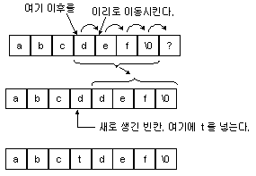

# Array
  - 같은 자료형을 가진 `연속된 메모리 공간`으로 이루어진 자료구조
  - Array의 첫번째 Element의 주소값이 Array의 이름이 되며 이를 `first address` 혹은 `foundation address`라고 부르고 이 주소값을 통해 Array를 이용할 수 있다.
  - Index를 통한 Random access가 가능하므로 Constant Time `O(1)`에 접근이 가능하다.
  - 메모리의 지역성을 보이므로 loop등 반복적으로 접근해야 할 경우 이점이 있다.

## Static Array
  - Array의 크기는 처음 생성 될 때 정해진다.
  - Static Array는 생성 될 때 고정 된 크기를 가지므로 일반적으로 Element를 insert하거나 delete 할 수 없다.

## Dynamic Array
  - 일반적으로 필요한 size보다 큰 Static Array를 만들어쓰는 방식으로 Dynamic Array를 구성 할 수 있다.
  - 단순히 Static Array의 size를 필요한 size보다 크게 만든다고 Dynamic Array가 되는 것은 아님
  - size는 Element가 적재되어 있는 논리적 크기인 `size`와 최대 이용가능한 물리적 size인 `capacity`로 나누어 볼 수 있다.
  - Dynamic Array에서 더 큰 capacity의 Array의 필요성이 생기면 더 큰 capacity의 Static Array를 새로 만들어 기존에 있던 배열을 통째로 복사해 옮기는 방식으로 capacity를 늘린다.(e.g. Java ArrayList)

## Dynamic Array에서의 Insert / Delete
  - 
  - Array는 연속된 메모리 공간에 저장되어 있다는 특성을 가지고 있으므로 Insert와 Delete시에 `Shift`가 일어난다.
  - 중간, 혹은 맨 처음에 Element Insert시 삽입될 위치와 뒤에있는 Element들이 메모리 주소상 뒤로 1칸씩 밀려야하므로 `O(n)`의 시간 복잡도가 필요하다.
  - Delete의 경우도 비슷한데 delete된 Element 뒤에 있는 Element들이 메모리 주소상 앞으로 1칸씩 당겨져야 하므로 `O(n)`의 시간 복잡도가 필요하다.
  - 단, 배열의 맨 뒤에 Insert / Delete하는 경우 Shift될 Element들이 존재하지 않으므로 `O(1)`의 시간 복잡도가 필요하다.
