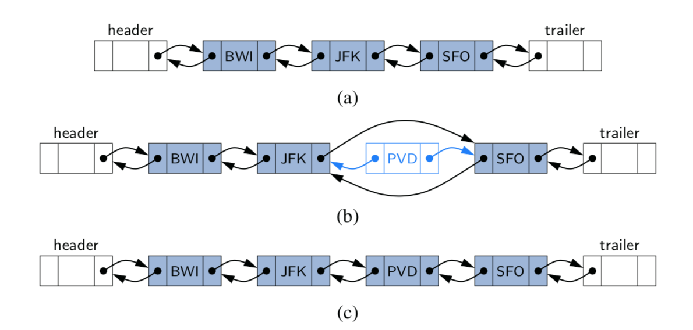
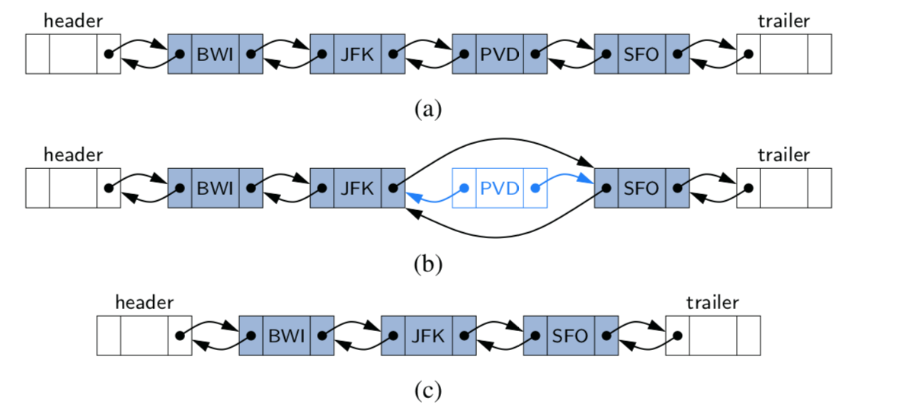

# Linked Lists
  - Linked List는 각 노드가 데이터와 포인터를 가지고 한 줄로 연결되어 있는 방식으로 데이터를 저장하는 자료 구조이다.
  - Array처럼 고정된 크기를 가지고 있지 않다.
  - Array처럼 데이터가 물리적으로 연속되어 연결되어 있지 않다.
  - 데이터 이외에 메모리 주소를 저장해야하므로 추가 메모리 공간이 필요하다.
  - Insert/delete가 Linked List의 중간에 자주 일어난다면 Array보다 Linked List를 이용하는 것이 유리하다.
    Linked List에서의 Insert/Delete는 포인터를 이용하기만 하면 되지만 Array는 Insert/Delete가 일어날 경우 실제 메모리에서 데이터의 Shift가 일어나기 때문

## Singly Linked List
  - 
  - Singly Linked List에서 각각의 Node는 자료와 다음 Node를 가르키는 포인터(Next)로 구성되어 있다.
  - 
  - `Head`는 Linked List의 첫 Node에 대한 포인터를 가지고 있다. 만약 Head가 가르키는 Node가 없다면 이를 통해 다른 Node를 찾을 방법이 없게된다.
  - `Tail`은 Linked List이 마지막 Node에 대한 포인터를 가지고 있다.
  - Tail은 Head부터 다음 Node로 탐색을 진행하며 Next가 `Null`인 Node를 찾음으로써 찾아낼 수 있다. (이렇게 Tail을 찾아내는 것을 link hopping이라고 함)
  - 일반적으로 Linked List에 Tail을 저장해 두어 매번 Tail을 찾는 탐색과정을 거치지 않게 한다.
  - Linked List의 size(length)또한 저장하고 유지하는 것이 일반적이다.
  - 특정 Node를 찾기 위해서는 Head부터 순차적인 탐색이 필요하다. Time complexity `O(n)`

### Singly Linked List 구현
#### Insert
  - addFirst(e) -> 첫번째 위치에 Node 추가
  - Time complexity `O(1)`
  ```
  Algorithm addFirst(e):
    newest = Node(e) ;; Node를 새로 만들고 newest에 저장
    newest.next = head ;; newest의 next가 현재 head인 Node를 가리키도록 함
    head = newest ;; head가 새로운 Node를 가리키도록 함
    size = size + 1 ;; size를 1 증가시킨다
  ```

  - addLast(e) -> 마지막 위치에 Node 추가
  - Time complexity `O(1)`
  ```
  Algorithm addLast(e):
    newest = Node(e) ;; Node를 새로 만들고 newest에 저장
    newest.next = null ;; newest의 next가 tail되어야 하므로 null을 가리키도록 함
    tail.next = newest ;; 현 시점의 tail의 next가 newest를 가리키도록 함
    tail = newest ;; tail이 새로운 Node를 가리키도록 함
    size = size + 1 ;; size를 1 증가시킨다
  ```

  - addBetween(e) -> 중간에 Node 추가
  - Time complexity `O(n)`
  - 탐색 시간 `O(n)` + insert하는 시간 `O(1)` = `O(n)`
  ```
  Algorithm addBetween(e, current): ;; 현재 위치 뒤에 Node 삽입
    newest = Node(e) ;; Node를 새로 만들고 newest에 저장
    newest.next = current.next ;; 새로운 Node의 next가 현재 위치의 다음 Node를 가리키도록 함
    current.next = newest ;; 현재 위치의 Node의 next가 새로운 Node를 가리키도록 함
    size = size + 1
  ```

#### Remove
  - removeFirst() -> 첫번째 Node 삭제
  - Time complexity `O(1)`
  ```
  Algorithm removeFirst()
    if head == null then
      the list is empty.
    head = head.next = head를 Head다음 Node로 지정
    size = size - 1
  ```

  - removeBetween(current) -> 중간 Node 삭제
  - 탐색 시간 `O(n)` + delete하는 시간 `O(1)` = `O(n)`
  ```
  Algorithm removeBetween(current)
    if head == null then
      the list is empty.
    before.next = current.next ;; current까지 탐색하는 과정에서 before도 알 수 있다.
    current = before
    size = size - 1
  ```

## Circular Linked List
  - 
  - 기본적으로 Single Linked List와 거의 동일하지만 `Tail.next`가 다시 `head`를 가리킨다는 것이 다르다.
  - 실제 Application에서는 cycle order를 이용할 필요가 생기기 때문 (Round robin schedule, 보드게임 사용자 턴)
  - 한번의 탐색 과정에서 previous node로의 접근이 가능해진다. (Singly Linked list는 head부터 재탐색 해야 함)
  - 이렇게 linked list에 cycle이 생기면 head와 tail을 구분할 필요가 없지만 필요에따라 구현해도 좋다.
  - `rotate()`라는 것을 이용해 tail의 position을 옮길 수 있음
  ```
  Algorithm rotate()
    if tail == null then
      the list is empty.
    tail = tail.next
  ```

## Doubly Linked List
  - 
  - Node에 next이외에 추가로 previous Node에대한 포인터를 저장함으로써 이전 Node에 접근이 가능하게 만든 Linked List
  - Previous Node의 주소를 저장해야해서 Singly Linked List보다 메모리를 더 사용한다.

### Doubly Linked List 구현
#### Insert
- 

```
Algorithm insertNode(e, current): ;; 현재위치 바로뒤에 삽입
  newest = Node(e) ;; 새로운 Node 생성
  newest.next = current.next ;; 새로운 Node의 next를 현재 위치 Node의 다음 Node를 가리키도록
  current.next = newest ;; 현재 위치의 Node의 next가 새로운 Node를 가르키도록
  newest.prev = current ;; 새로운 Node의 prev가 현재 위치 Node를 가르키도록
  if newest.next != null then
    newest.next.prev = newest ;; 현재 위치 다음 Node의 prev가 새로운 Node를 가르키도록
```

#### Delete
- 

```
Algorithm deleteNode(current):
  current.prev.next = current.next
  current.next.prev = current.prev
```
