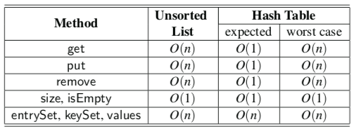

# Maps(or associative arrays)
- Map은 Unique한 search Key를 기반으로 값을 효율적으로 저장하고 검색하도록 설계된 Abstract Data Type이다.
- 고유한(Unique) 값의 key `k`와 k에 대응되는 value `v`가 한 쌍으로 map에 저장된다.
- Map은 고유한 key값을 가지는 점에서 array의 index와 유사한 특징을 가지고 있기 때문에 `associative arrays`라고 하기도 한다. 하지만 기본적인 array와는 다르게 key값이 꼭 숫자일 필요는 없으며
  array의 index처럼 key값이 data 구조 내의 위치를 지정하지도 않는다.

## Hash Table

- Hash Table은 Map의 ADT를 구현해 만든 자료구조이다.
- 더 자세한 설명이 필요하면 이 [블로그](https://ratsgo.github.io/data%20structure&algorithm/2017/10/25/hash/)를 참고
- 기본 적인 개념은 `hash function`을 이용해 array에 저장 될 index를 구하고 value를 저장한다.
- `index = hashFunction(key) % sizeOfArray`
- hash function 한 번만 계산해주면 바로 index를 알 수 있기 때문에 데이터의 저장과 삭제가 매우 빠르다.

### Hash Function
- Hash function은 각 Key `k`를 [0, N-1] 범위의 정수(array의 index)로 바꿔주는 함수이다. (N 사이즈의 array에 저장 할 수 있도록)
- 동일한 hash 값을 가진 두 개 이상의 키가 있는 경우 `collision(충돌)`이 발생 할 수 있다.
- 이러한 충돌이 되도록 발생하지 않도록 정해진 범위 내의 hash 값을 고르게 만들어 줄 수 있는 Hash function이 좋은 Hash function이다.
- Hash function은 `hash code`와 `compression function(압축 함수)` 두가지 부분으로 나눌 수 있다.
- Hash code
  - Key값을 정수로 바꿔주는 부분
- compression function
  - hash code를 정해진 범위 내의 숫자로 바꿔주는 부분 (배열의 크기 이내 등)
  - 단순히 나머지를 이용해 구할 수 있다. `i Mod N`이, N이 소수일 경우 충돌을 좀 더 줄일 수 있다.
  - 또 한가지 방법은 `Multiply-Add-and-Divide(MAD)`방식을 사용하는 것이다.
  - `[(ai+b) mod p] mod N`, p는 N보다 큰 소수이며, a와 b는 [0, p-1]범위 내의 무작위 두 수이며 a > 0이다. 이 방식은 충돌 확률을 `1/N`에 가깝게 되도록 만들어 준다.
- 두가지 부분으로 나누었을 때 이점은, hash code가 테이블의 크기에 독립적으로 관리될 수 있기 때문이다.
- compression function만 바꾸어주면 hash code를 변경하지 않고 동적으로 해시 테이블에 이용된 기본 array의 크기를 바꿀 수 있다.

### Collision-Handling
- 동일한 Hash 값을 가진 key가 생기면 저장할 때 collision이 생긴다. 이를 해결하는 법을 알아보자

#### Separate Chaining

- Array의 각 index가 Linked list의 포인터를 가지는 방식
- 동일한 index로 인해 collision이 발생하면 해당 index가 가리키고 있는 Linked list에 노드를 추가하여 값을 추가.
- 데이터를 검색할 때는 Key값으로 index를 찾고 해당 index가 가리키고 있는 Linkded list에서 key값으로 알맞은 node를 탐색한다.
- 이 방법은 키가 있는 항목들을 유지하기 위해 추가 공간이 필요하므로 공간 제약이 있는 경우 알맞지 않다. (각 index별로 linked list를 가리키는 포인터를 가지게 되므로)

#### Open Addressing
- Spearate Chaning과는 다르게 추가적인 공간을 사용하지 않고 hash table array의 빈 공간을 이용하는 방법
- Open Addressing을 구현하는 방법은 여러가지가 있지만 가장 간단한 것은 `Linear Probing`이다.

##### Linear Probing

- collision이 일어나면 정해진 고정된 계수만큼 index를 건너 뛰며 빈 공간에 값을 할당하는 방식
- 이러한 방식 때문에 같은 hash 값에 데이터가 몰리면 성능이 떨어진다.
- 삭제와 탐색을 진행할 때 고려해야될 문제들이 있다.
  - 탐색을 진행 할 때 원하는 값을 찾기 위해서 hash function으로 index를 찾고 원하는 값이 나올때 까지 고정된 계수만큼 index를 건너뛰며 탐색을 한다. 이때 원하는 값을 찾거나 빈 공간을 찾으면 탐색이 끝난다.
  - 빈 공간을 찾으면 탐색이 끝나는 이유는 collision이 일어났으면 특정 값을 찾을 때 까지 빈 공간이 나오면 안되기 때문이다. 물론 이 경우는 원하는 값을 찾지 못한 경우이다.
  - 삭제시에는 탐색과 마찬가지로 진행되지만 원하는 값을 찾은 경우 값을 지우는 대신 `Dummy Data`로 교체한다. 왜냐하면 탐색은 빈 공간을 찾을 경우에도 끝나므로 탐색을 원하는 값이 저장되어있음에도 빈 공간 때문에 탐색이 실패할 수 있기 때문이다.
  - 즉 Dummy Data는 탐색을 계속 이어나갈 수 있게 해준다.
- 저장과 삭제가 빈번히 일어나게 되면 Dummy Data들이 쌓이게되고 가령 Dummy Data가 없다고 하더라도 저장과 삭제시에 탐색에 걸리는 시간이 증가하므로 어느정도 Hash Table array가 찼다면 Hash Table에 이용되는 array의 크기를 늘려주면서 기존 값들을 `Rehashing` 해주는 것이 성능 향상에 좋다

### Time complexity

- Open Addressing 혹은 Separate Chaining의 Worst case는 모든 key값이 같은 index에 저장되는 것이므로 `O(n)`이다.
