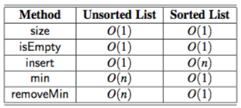

# Priority Queue
- 이름은 Queue이지만 FIFO를 따르지 않는다. 삽입 순서는 상관 없지만 제거시엔 Priority가 가장 높은 Entry부터 제거해나간다.
- 우선순위를 나타내는 Key를 Element와 함께 저장하여(`Entry<K, V>`) Key로 priority를 구별한다.

## ADT
- insert(k, v): Key k와 Value v를 갖는 entry를 만들어 priority queue에 삽입
- min(): Minimal priority key를 가지는 entry를 반환하며 제거는 하지 않음 (만약 큐가 비어있다면 null 반환)
- removeMin(): Minimal priority key를 가지는 entry를 반환하고 제거 (만약 큐가 비어있다면 null 반환)
- size(): Priority Queue의 entry의 개수 반환
- isEmpty(): Priority Queue가 비어있는지 확인

## 구현
### Unsorted List로 구현
``` java
public class UnsortedPriorityQueue<K,V> extends AbstractPriorityQueue<K,V> {
    private PositionalList<Entry<K,V>> list = new LinkedPositionalList<>();
    public UnsortedPriorityQueue() { super(); }
    public UnsortedPriorityQueue(Comparator<K> comp) { super(comp); }

    private Position<Entry<K,V>> findMin() { // Big-O O(n)
        Position<Entry<K,V>> small = list.first();
        for (Position<Entry<K,V>> walk : list.positions())
            if (compare(walk.getElement(), small.getElement()) < 0)
				        small = walk; // found an even smaller key
        return small;
    }

    public Entry<K,V> insert(K key, V value) throws IllegalArgumentException { // Big-O O(1)
		    checkKey(key); // auxiliary key-checking method (could throw exception)
        Entry<K,V> newest = new PQEntry<>(key, value);
				list.addLast(newest);
        return newest;
    }
    public Entry<K,V> min() { // Big-O O(n)
        if (list.isEmpty()) return null;
        return findMin().getElement();
		}
    public Entry<K,V> removeMin() { // Big-O O(n)
        if (list.isEmpty()) return null;
        return list.remove(findMin());
		}
    public int size() { return list.size(); } // Big-O O(1)
}
```
### Sorted List로 구현

``` java
public class SortedPriorityQueue<K, V> extends AbstractPriorityQueue<K, V> {
    private PositionalList<Entry<K, V>> list = new LinkedPositionalList<>();

    public SortedPriorityQueue() { super(); }
    public SortedPriorityQueue(Comparator<K> comp) { super(comp); }
	
    public Entry<K, V> insert(K key, V value) throws IllegalArgumentException {
        checkKey(key);
	Entry<K, V> newest = new PQEntry<>(key, value);
	Position<Entry<K, V>> walk = list.last();
	// Doubly Linked List로 구현하여 last node부터 거꾸로 탐색해 insert가 용이하도록 구현한다.
	while (walk != null &amp;&amp; compare(newest, walk.getElement()) < 0)
	    walk = list.before(walk);
        if (walk == null)
            list.addFirst(newest);
	else
            list.addAfter(walk, newest);
	return newest;
    }
    
    public Entry<K, V> min() {
        if (list.isEmpty()) return null;
	return list.first().getElement();
    }

    public Entry<K, V> removeMin() {
        if (list.isEmpty()) return null;
	return list.remove(list.first());
    }

    public int size() { return list.size(); }
}
```

### Unsorted List와 Sorted List로 구현한 Priority Queue의 차이

- Unsorted List는 정렬된 순서가 없기 때문에 특정 규칙을 따를 필요 없이 Linked List의 마지막에 node를 추가하므로 빠르다 `O(1)`
- Unsorted List는 정렬된 순서가 없어 가장 높은 priority의 Entry를 찾기 위해선 모든 node를 탐색해야 하므로 `O(n)`
- Sorted List는 정렬된 순서를 가지고 있기 때문에 Priority가 가장 높은 Entry가 List의 항상 처음에 존재하므로 제거가 빠르다 `O(1)`
- Sorted List는 정렬된 순서를 가지고 있어 삽입을 하려면 올바른 위치를 찾아야 하므로 모든 노드를 탐색해야 할 수도 있다 `O(n)`

### Heap으로 구현
- priority가 높거나 낮은 Node부터 제거해야하는 `Priority Queue` 특성상 Heap과 유사한 속성을 가지고 있다.
- 때문에 대부분의 Priority Queue는 Heap으로 구현됨.
- 자세한 내용은  참고
