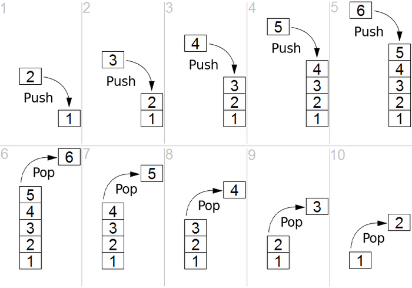

# Stacks
- 
- Stack은 LIFO(Last-In, First-Out) 방식으로 삽입되고 제거되는 자료구조이다.
- 브라우저에서 방문 기록을 저장하는 방식 등 실제로 많이 사용되고 있는 자료구조
- ADT(Abstract Data Type)
  - push(e): Stack의 맨 위에 Element를 추가한다.
  - pop(): Stack의 맨 위에 있는 Element를 제거하면서 해당 값을 return한다. (Stack이 비어있으면 null을 return)
  - top() 혹은 peek(): Stack의 맨 위에 있는 Element를 return한다.
  - size(): stack의 크기를 return한다.
  - isEmpty(): Stack이 비어있는지 확인한다.(Boolean)

## Array로 구현한 Stack
``` java
public class ArrayStack<E> implements Stack<E> {
    public static final int CAPACITY = 1000;
    private E[] data;
    private int t = -1;
    public ArrayStack() { this(CAPACITY) };
    public ArrayStack(int capacity) {
        // 필요한 만큼만 capacity를 설정할 수 있어 메모리 낭비를 최소화 할 수 있게 만들었다.
        data = (E[]) new Object[capacity];
    }
    pubic int size() { return (t + 1) };
    public boolean isEmpty() { return (t == -1) };
    public void push(E e) throws IllegalStateException {// Time Comlexity O(1)
        if (size() == data.length) throw new IllegalStateException("Stack is full");
        data[++t] = e;
    }
    public E top() {
        if (isEmpty()) return null;
        return data[t];
    }
    public E pop() {// Time Comlexity O(1)
        if (isEmpty()) return null;
        E answer = data[t];
        data[t] = null; // null로 만들지 않아도 돌아가기야 하겠지만 GC를 위해서 이렇게 하는게 좋음
        t--;
        return answer;
    }
}
```

## Linked-List로 구현한 Stack
``` java
public class LinkedStack<E> implements Stack<E> {
    private SinglyLinkedList<E> list = new SinglyLinkedList<>();
    public LinkedStack() {}
    public int size() { return list.size(); }
    public boolean isEmpty() { return list.isEmpty(); }
    public void push(E element) { list.addFirst(element); }
    public E top() { return list.first(); }
    public E pop() { return list.removeFirst(); }
}
```
