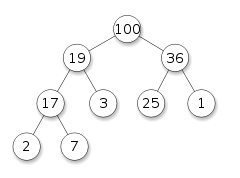

# Heap

- Heap은 tree-based data structure이다.
- Parent와 child의 key값에 따라 `Max Heap`과 `Min Heap`으로 나눌 수 있다.
  - 오직 Parent-child 사이의 관계에만 연관성이 있다.
  - Parent Node의 Key값 `P`,Child Node의 Key값 `C`
  - Max Heap: `P >= C`
  - Min Heap: `P <= C`
- root node를 top이라고 부른다.
- Heap은 Sorted Structure가 아니고 부분적으로 정렬 된 것처럼 보일 뿐이다.
- Heap은 Priority가 가장 높거나 낮은 node를 반복적으로 제거해야 할 때 유용한 Data structure이다.
- 일반적으로 Heap은 Binary Tree로 구현된 `Binary Heap`이다.

## 구현
- 일반적으로 Array를 사용해 구현하고 one-based-array로 구현하기도 한다.(구현할때 index 계산이 편해짐)
- 아래는 0-based array로 구현됨
- insert와 delete
  - insert (min-heap 기준)
    1. Full binary Tree를 유지하기위해 Tree의 맨 마지막 level에서 가장 오른쪽에 추가.
    2. 새로 추가한 node와 parent를 비교하여 `P > C` 라면 swap(P, C) (max-heap이면 P < C인 경우)
    3. 반복해서 parent와 비교한다.
    4. root에 도달했거나 P > C를 만족하지 않는다면 멈춤
  - delete (min-heap 기준)
    1. root 노드를 return한다.
    2. 맨 마지막 노드를 root 노드로 이동
    3. child 중 priority가 높은 것(더 작은 수)를 선택
    4. swap(P, C)
    5. 반복하여 child와 비교
    6. leaf node에 도착했거나 P > C를 만족하지 않는다면 멈춤
- Time-Complexity
  - Search: `O(n)`
  - Insert: `O(log n)`
  - delete: `O(log n)`
  - peek: `O(1)`
  - Full binary tree에서 노드의 수가 `n`이라면 높이는 이므로 worst case기준 모든 leaf까지 탐색하여 `O(log n)`이다.

``` java
public class minHeap {
    private ArrayList<Integer> heap = new ArrayList<>();

    public int getLeftChild(int idx) {
        return idx * 2 + 1;
    }

    public int getRightChild(int idx) {
        return idx * 2 + 2;
    }

    public int getParent(int idx) {
        if (idx % 2 == 0) return (idx / 2) - 1;
        return idx / 2;
    }

    public int getPriority(int value1, int value2) {
        return Integer.compare(value1, value2);
    }

    public boolean isEmpty() {
        return heap.isEmpty();
    }

    public void print() {
        for (Integer el : heap) {
            System.out.print(el + " ");
        }
        System.out.println();
    }

    private boolean isGoUp(int idx, int value) {
        if (idx <= 1) return false;
        int parent_value = heap.get(getParent(idx));

        return getPriority(parent_value, value) == 1;
    }

    private int getPriorityChild(int idx) {
        int leftChildIdx = getLeftChild(idx);
        if (leftChildIdx > heap.size() - 1) {
            return -1;
        } else if (leftChildIdx == heap.size() - 1) {
            return leftChildIdx;
        }
        int rightChildIdx = getRightChild(idx);
        int leftChildValue = heap.get(leftChildIdx);
        int rightChildValue = heap.get(rightChildIdx);

        if (getPriority(leftChildValue, rightChildValue) == -1) {
            return leftChildIdx;
        } else {
            return rightChildIdx;
        }

    }

    private boolean isGoDown(int idx, int value) {
        int childIdx = getPriorityChild(idx);
        if (childIdx == -1) {
            return false;
        }
        int childValue = heap.get(childIdx);

        return getPriority(childValue, value) == -1;
    }

    public int size() {
        return heap.size();
    }

    public void insert(int el) {
        if (isEmpty()) {
            heap.add(el);
            return;
        }

        heap.add(el);

        int newest_idx = heap.size() - 1;

        while (isGoUp(newest_idx, el)) {
            int parent_idx = getParent(newest_idx);
            heap.set(newest_idx, heap.get(parent_idx));

            newest_idx = parent_idx;
        }

        heap.set(newest_idx, el);
    }

    private void swap(int node1, int node2) {
        int temp = heap.get(node1);
        heap.set(node1, heap.get(node2));
        heap.set(node2, temp);
    }

    public int removeMin() {
        int top = heap.get(0);
        int lastIdx = heap.size() - 1;
        int lastData = heap.get(lastIdx);

        int idx_value = 0;
        heap.set(0, lastData);
        heap.remove(lastIdx);
        while (isGoDown(idx_value, lastData)) {
            int child_idx = getPriorityChild(idx_value);
            swap(idx_value, child_idx);
            idx_value = child_idx;
        }

        return top;
    }

    public static void main(String[] args) {
        minHeap heap = new minHeap();
        heap.insert(3);
        heap.insert(5);
        heap.insert(1);
        heap.insert(10);
        heap.insert(8);
        heap.insert(7);
        heap.insert(4);
        heap.insert(5);
        heap.insert(2);
        heap.insert(6);
        heap.insert(9);

        heap.print();

        int heapSize = heap.size() - 1;
        for (int i = 0; i <= heapSize; i++) {
            System.out.print(heap.removeMin() + " ");
        }
    }
}
```
