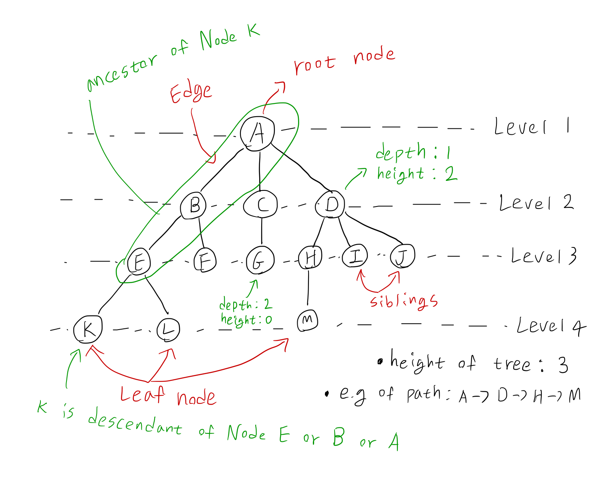
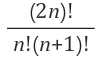
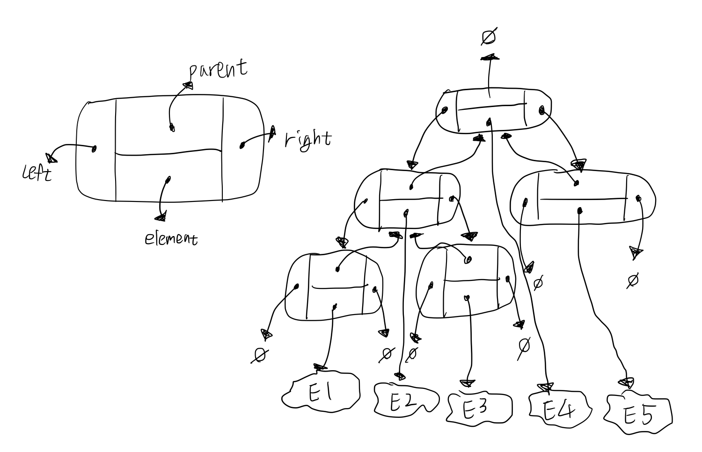
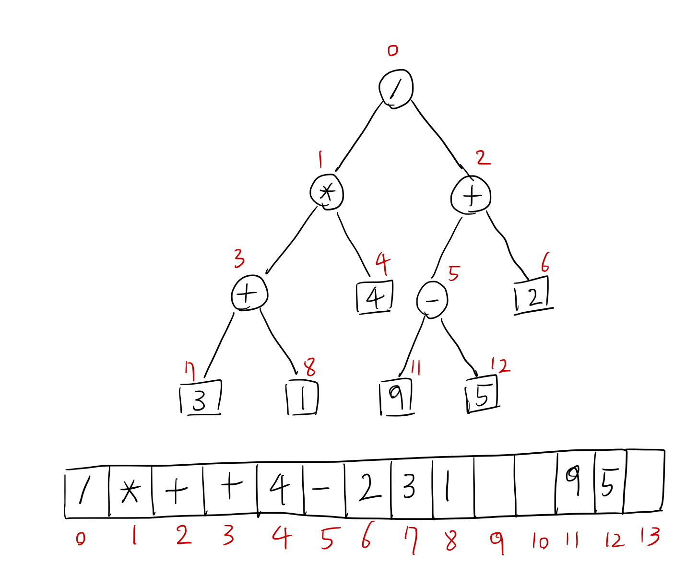
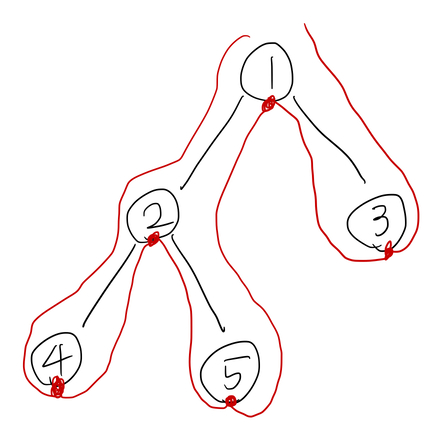
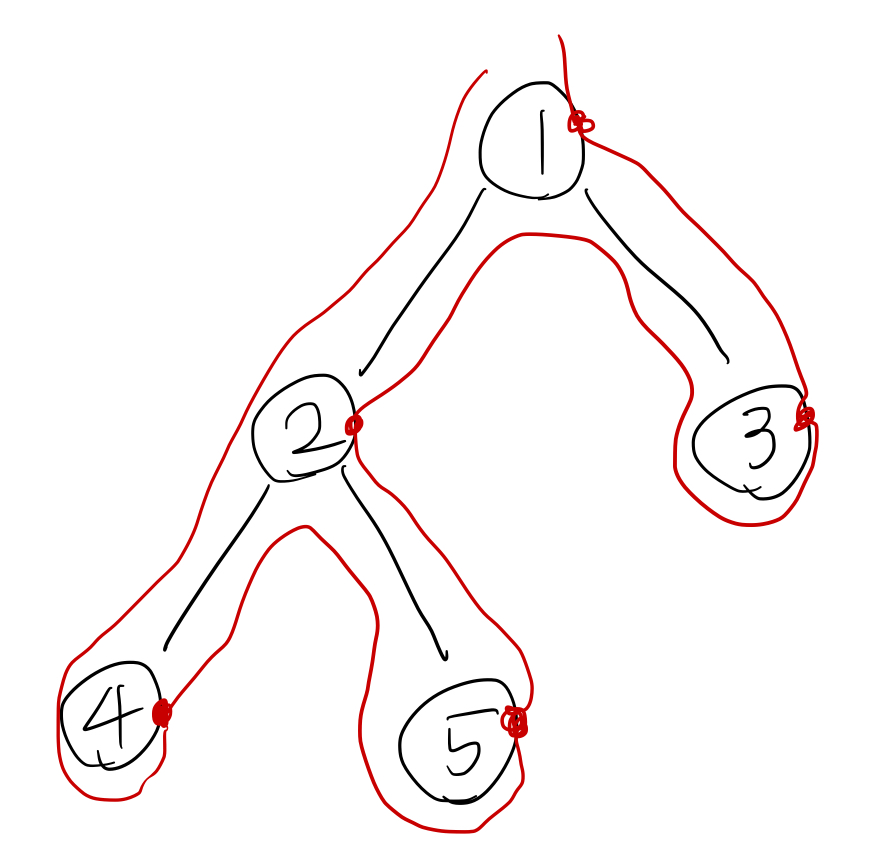
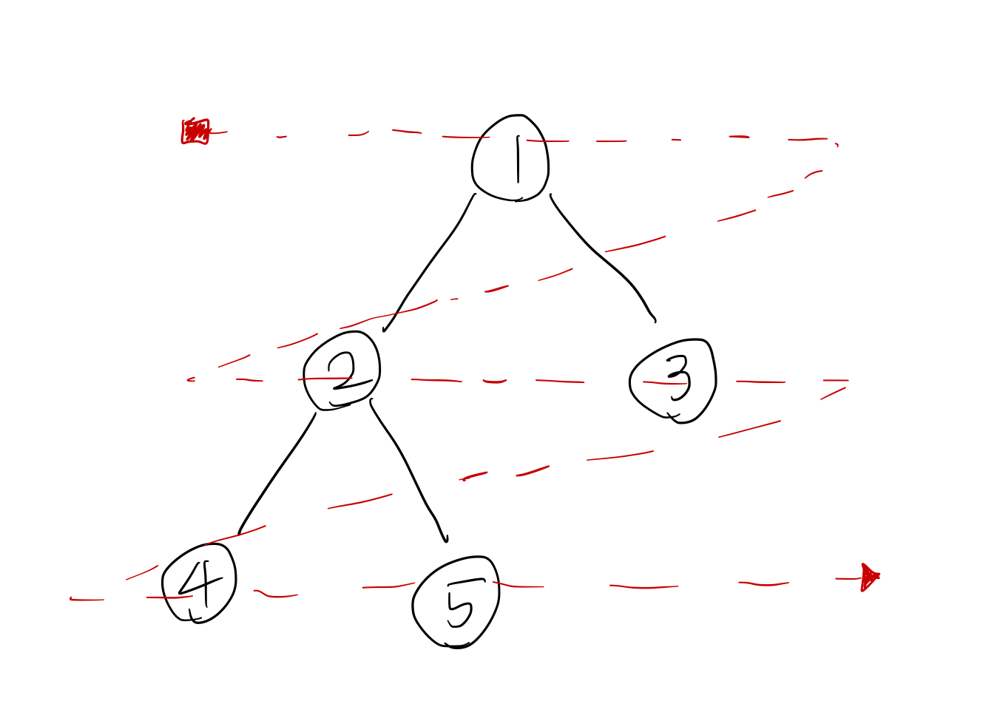

# Tree
## 개념
- Tree `T`는 `parent-child relationship`을 갖도록 Element를 저장하는 node의 집합이다.
- parent-child relationship은 다음과 같은 속성을 만족해야한다.
  - Tree `T`가 비어있지 않으면 `T`는 parent가 없는 특별한 node인 `root`를 가진다.
  - Tree `T`의 각각의 노드 `v`에는 parent node인 `w`가 존재한다; `w`를 parent node로 갖는 모든 nodesms `w`의 child node이다.

- Empty Tree (node가 하나도 없는 Tree)가 존재할 수 있다.

## Tree가 될 수 없는 경우
1. node의 edge가 자기 자신을 향하는 경우
2. path에서 cycle이 생기는 경우
3. node가 2개 이상의 parent를 가지는 경우
4. 서로 연결되지 않은 subtree가 존재하는 경우

## 용어

- siblings node(형제): 같은 parent를 갖는 node들을 `siblings(형제)`라고 부른다.
- Leaf node(리프): node에 child가 하나도 없으면 이를 `external node`라고 하고 leaf라고 부른다.
- internal node: child가 하나라도 존재하면 `internal`하다고 한다.
- ancestor(조상): 어떤한 child node `v`에서 반복해서 parent node를 찾으며 올라갈 때 거쳤던 모든 node들을 `v`의 ancestor라고 한다.
- descendant(자손): 어떠한 parent node `v`에서 반복해서 child node를 찾을 때 찾을 수 있는 모든 node들을 `v`의 descendant라고 한다.
- edge(에지): 두 node간의 연결되어 있는 선을 edge라고 한다.
- path(경로): 한 node와 다른 node를 연결하는 일련의 node 및 edge의 순서
- length(길이): 출발 node에서 도착 node까지 거치는 node의 개수
- depth(깊이): root node에서 다른 node까지의 edge의 수
- height(높이)
  - height of node: 해당 노드부터 가장 먼 leaf node까지 연결된 edge의 개수
  - height of tree: root 노드부터 가장 먼 leaf node까지 연결된 edge의 개수
- degree(차수): 해당 node의 subtree의 개수
- size(크기): node의 개수
- level(계층): Tree에서 각 계층을 나타내며 루트(level 1)부터 단계마다 +1씩 증가한다.

## Ordered Tree
- 각 node가 유의미한 순서를 가지는 정렬된 Tree
- 대개 순서에 따라 왼쪽에서 오른쪽으로 정렬하여 시각화한다.

## ADT
- Tree의 node에 대한 추상화로서 `position`이라는 개념을 사용한다.
- getElement(): 현재 position의 element를 return한다.
- root(): root의 position을 return한다. (빈 Tree일 경우 null을 return)
- parent(p): position `p`에 대한 parent 의 position을 return한다. (p 가 root를 가리킬 경우 null을 return)
- children(p): child node가 존재하는 경우 position `p`에 대한 모든 child node를 return한다.
- numChildren(p): position `p`에 대한 child node의 개수를 return한다.
- isInternal(p): position `p`가 적어도 1개 이상의 child를 가지고 있으면 `true`를 return한다.
- isExternal(p): position `p`가 child를 가지고 있지 않으면 `true`를 return한다.
- isRoot(p): position `p`가 root이면 `true`를 return한다.
- size(): Tree에 포함 되어 있는 모든 position의 개수를 return한다.
- isEmpty(): Tree에 어떠한 position도 속해있지 않으면 `true`를 return한다.
- iterator(): Tree의 모든 Element에 대한 Iterator를 return한다.
- positions(): Tree의 모든 position에 대한 iterable collection을 return한다.

## Binary Trees
- Binary Tree는 다음 원리를 만족하는 ordered tree이다.
  1. 모든 node는 최대 두 개의 child node를 가진다.
  2. 각각의 child node는 left child 혹은 right child로 이름 붙여진다.
  3. left child node가 right child node보다 순서가 앞선다.

- internal node `v`의 왼쪽 또는 오른쪽 child를 root로 하는 subtree를 `v`의 left subtree, right subtree라고 한다.
- 각 node가 leaf node를 제외하고 2개의 child를 가질때 이를 `full binary tree` 라고 한다.
- 각 마지막 level을 제외한 모든 레벨이 완전히 채워지고 모든 node가 왼쪽 child부터 채워진 상태일때 `complete binary tree`라고 한다.


- level이 n인 Binary Tree의 최대 node수는 `2^n-1`개이다. (root가 level 1부터 시작시)
- Binary Tree의 leaf node의 개수는 degree가 2인 node의 개수 +1이다.
- node 개수 `n`개로 이루어진 서로 다른 Binary Tree의 개수는 `Catalan number`와 같다.



### Linked Binary Tree

- Single Node와 Bianry Tree를 표현

### Array-Based Binary Tree

- position p가 `root`이면 `f(p) = 0` (root node의 index는 항상 0)
- position p가 `left child`면 `f(p) = 2f(q) + 1`
- position p가 `right child`면 `f(p) = 2f(q) + 2`

- Array-based Binary Tree의 장점은 position `p`가 single integer `f(p)`로 표현된다는 점이다.
- root, parent, left, right등 모든 position을 구할 때 `f(p)`를 통해 구할 수 있다.

- Array-based Binary Tree는 Tree의 모양에 따라 Array의 size가 결정된다.
- Array의 length `N`, node의 개수 `n`일때 최악의 경우 `N = 2^n - 1`까지 될 수 있다. (공간 필요량이 너무 많다)

## Tree Traversal Algorithms
### Depth-first Tree Traversal
- 깊이 우선 탐색
- 재귀적으로 leaf 노드까지 우선 방문하며 탐색한다.
#### Pre-order

``` java
void preorder(Node node) {
    if (node == null) return;
    Display node.element // display 부분이 맨 앞에 있음
    preorder(node.leftSubtree);
    preorder(node.rightSubtree);
}
```
- preorder: 1 -> 2 -> 4 -> 5 -> 3

#### In-order

``` java
void inorder(Node node) {
    if (node == null) return;
    inorder(node.leftSubtree);
    Display node.element음 // display 부분이 가운데 있음
    inorder(node.rightSubtree);
}
```
- inorder: 4 -> 2 -> 5 -> 1 -> 3

#### Post-order

``` java
void postorder(Node node) {
    if (node == null) return;
    postorder(node.leftSubtree);
    postorder(node.rightSubtree);
    Display node.element // display 부분이 맨 뒤에 있음
}
```
- postorder: 4 -> 5 -> 2 -> 3 -> 1

### Breadth-First Tree Traversal

- 너비 우선 탐색
- 같은 level에 있는 node들 부터 순차적으로 탐색한다.
``` java
void breadthfirst() {
    Queue queue = new Queue(); // Queue를 새로 만든다
    queue.enqueue(root); // Queue에 root의 position을 enqueue

    while (queue.isEmpty()) {
        p = queue.dequeue();
        Display p.element
        for (Position c : children(p)) {
            queue.enqueue(c); // 현재 position의 child node를 순서대로 enqueue
        }
    }
}
```
- Breadth-First: 1 -> 2 -> 3 -> 4 -> 5

### DFS vs BFS
- 모든 탐색에서 `O(n)`의 Time complexity를 보인다. (모든 노드를 탐색하므로)
- BFS는 `O(w)`의 공간이 추가로 필요하다. w는 Binary Tree의 maximum width (Queue에 같은 level에 있는 node들이 쌓이므로)
- DFS는 `O(h)`의 공간이 추가로 필요하다. h는 Binary Tree의 maximum height (Call stack에 모든 ancestors가 쌓이므로)
- DFS는 재귀적으로 동작하므로 function call overhead가 필요로하다.
- 우리가 Search를 진행 할 때 우리가 찾고자 하는 것이 Root쪽에 가까울 확률이 높으면 BFS를, Leaf쪽에 가까울 확률이 높으면 DFS를 사용하는 것이 좋다.
