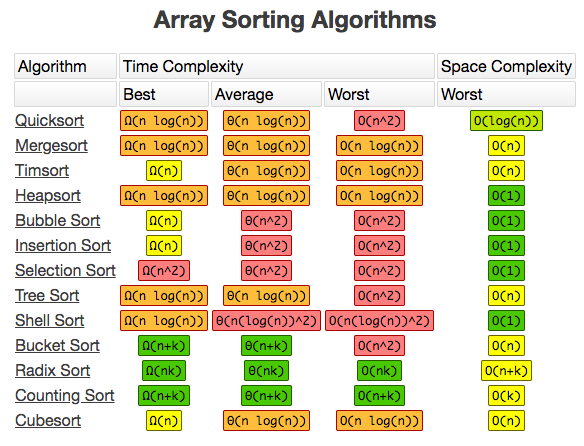

# 역대 면접 질문

> 여러 곳 면접을 보면서 받았던 질문 중 생각나는 것들을 모았습니다.

## 목차

### [Sorting](#)

1. Sorting Algorithm에서 stable 하다는 것은 무엇을 의미하나요?
2. Sorting Algorithm이 가짓수가 많은데 그 이유가 무엇일 것 같나요?
3. Quick sort에 대해서 설명해 줄 수 있나요?

### OS

1. 프로세스 생성 과정에 대해서 설명해보세요
2. 크롬 탭이 프로세스인지 쓰레드인지 설명해보세요
3. 프로세스와 쓰레드의 차이를 설명해보세요
4. 프로세스의 생성 과정에 대해 설명해보세요
5. Heap과 Stack의 차이점은 무엇인가요?

### Network

1. HTTPS란?
2. TCP와 UDP의 차이점은?
3. TCP란 무엇인가?
4. 브라우저에서 주소창에 url 입력시 어떤일이 일어나는가?

### DB

1. postgresql과 elastic search의 차이점은 무엇인가요?

### Front-End

1. 평소 Angular를 사용할때 State 관리는 어떤 식으로 했나요?
2. Redux가 뭔지 아시나요? 안다면 어떤건지 설명해 줄 수 있나요?
3. javascript sourcemap에 대해 알고있나요? 알고있다면 Production에서 sourcemap을 디버깅할 수 있는 방법을 알고있나요?

## 답변

> 답변은 개인적으로 찾아보고 공부해서 써놓은 것으로 틀릴 수 있습니다.

----

### Sorting Solution

#### Sorting Algorithm에서 stable 하다는 것은 무엇을 의미하나요

동일한 Element가 있을 때 정렬 전의 순서와 정렬 후의 순서가 동일함을 보장하는 것이
Stable이다.

예를 들어 `[{k: 4, v: 1}, {k: 3, v: 2}, {k: 3, v: 1}, {k: 2, v: 1}, {k: 5, v: 1}]` 을 stable한 sorting algorithm을 이용한다면.

`[{k: 2, v: 1}, {k: 3, v: 2}, {k: 3, v: 1}, {k: 4, v: 1}, {k: 5, v: 1}]`가 된다. (k가 3인 동일한 정렬 기준을 가진 Element가 2개가 있지만 input된 순서 그대로 정렬되었다.)

#### Sorting Algorithm이 가짓수가 많은데 그 이유가 무엇일 것 같나요

출처: [http://bigocheatsheet.com/](http://bigocheatsheet.com/)

1. sorting algorithm마다 expected되는 속도가 다르다.
2. 속도가 아닌 Space Comlexity가 고려대상이 될 수 있다. Merge sort같은 경우 insertion sort나 selection sort에 비해 추가 메모리 공간을 사용하기 때문
3. Stable한지 안한지에 따라 사용되어야 할 sorting algorithm이 다를 수 있다.

#### Quick sort에 대해서 설명해 줄 수 있나요

Quick sort는 Divide-and-Conquer paradigm을 이용해 정렬을 수행하는 정렬 알고리즘이며 그중에서도 Partitioning이라는 아이디어를 이용한다.

Partitioning이란 Pivot element를 기준으로 왼쪽은 Pivot보다 작거나 같은 것을 모아주고 오른쪽은 Pivot보다 크거나 같은것을 모아주는 것을 말한다.

Partitioning을 재귀적으로 진행하다보면 정렬이 완료된다.

----

### OS Solution

#### 프로세스 생성 과정에 대해서 설명해보세요

일반적인 프로세스 생성 과정

1. PCB가 생성되며 OS가 실행한 프로그램의 코드를 읽어들여 프로세스에 할당된 메모리의 Text segment에 저장한다.
2. 초기화된 전역 변수 및 static 변수를 data segment에 할당.
3. HEAP과 Stack은 초기 메모리 주소만 초기화됨.
4. PCB에 여러 정보가 기록되면 Ready Queue에서 CPU를 할당받기까지 대기한다.

#### 프로세스와 쓰레드의 차이를 설명해보세요

프로세스는 실행되는 프로그램 자체와 프로그램이 실행되는 주변 환경을 포함하는 개념이다.
실행되는 주변 환경이란 사용중인 파일, 데이터, 메모리 영역 주소 공간등을 뜻한다.

쓰레드는 프로세스 내부에서 프로세스의 자원을 공유하거나 공유하지 않고 실행되는 작업의 단위이다.

#### Heap과 Stack의 차이점은 무엇인가요

Heap은 메모리 주소가 낮은 영역부터 채워지고 Stack은 메모리 주소가 높은 영역부터 채워진다.

1. Heap: 동적 할당을 할 경우 Heap 영역에 할당됨
2. Stack: 함수를 호출할 때 함수내부의 지역변수를 저장하거나 함수를 호출한 caller의 환경정보를 저장함.

결론적으로 물리적으론 같은 메모리 공간을 공유하지만 쓰임새가 다르고 서로의 영역을 누가 침범하느냐에 따라 Stack overflow, Heap overflow가 일어난다.

- [http://www.phrack.org/archives/issues/49/14.txt](http://www.phrack.org/archives/issues/49/14.txt)

#### 크롬 탭이 프로세스인지 쓰레드인가요

> 진지한 질문은 아니었고 알고있는지, 그래서 일어나는 특성이 뭔지 물어보려는 것 같았음

크롬은 탭마다 PID를 가지고 있으니 Process이며 각 Tab마다 랜더링 정보나 기타 데이터를
따로 관리한다고 한다. 그로인해 메모리를 많이 잡아먹기도 하지만 하나의 Tab에 오류가 생겼다고
모든 Tab에 영향을 끼치진 않는다.

----

### Network Solution

#### HTTPS란

HTTP Secure의 약자이며 HTTPS를 사용하여 전송되는 데이터는 TLS를 통해 보호된다.

TLS는 Certificate Authority(CA)라 불리는 서드 파티로부터 서버와 클라이언트
의 인증을 하는데 사용된다.

SSL(TLS) 동작방식

1. 클라이언트가 서버에 접속하며 랜덤 데이터를 전송. (Client hello)
2. 서버가 Client hello에 대한 응답으로 `Server hello`를 함 (이때 인증서와 랜덤데이터 제공)
3. 클라이언트의 브라우저에서 서버가 건네준 인증서가 CA에서 발급된건지를 확인하고 공개키로 인증서를 복호화한다. (인증서가 믿을 수 있다고 판단함)
4. 클라이언트와 서버의 각각의 랜덤 데이터를 가지고 클라이언트에서 `pre master secret`값을 만들어냄 (대칭키)
5. pre master secret 값을 비대칭키 (클라이언트가 알고있는 공개키)를 이용하여 암호화하고 이를 서버에 보냄 이렇게 암호화 된 값을 `master secret`이라하고 이는 `session key`를 만들어냄
6. 이 session key를 이용하여 서버와 클라이언트는 `대칭키` 방식으로 암호화 통신을 함

#### TCP와 UDP의 차이점은

TCP는 연결 동작을 통해 ACK와 Sequence Number를 주고받으며 신뢰성과 흐름제어를 제공하는 방면 UDP는 IP를 거의 그대로 사용하며 단순히 Checksum말고는 데이터의 회손을 감지할 수 없다. 또한 ACK와 Sequence Number를 주고받지 않으므로 중간에 데이터가 유실되어도 이를 다시 요청하거나 할 수 있는 방법이 없다. 또한 TCP와 다르게 UDP는 혼잡을 제어할 수 있는 방법이 없다.

#### TCP란 무엇인가

데이터의 송수신을 위해 IP를 이용하는 프로토콜이며 통신간에 신뢰성을 보장해주기 위해 만든 것이다.

TCP는 3-way handshake라고 불리는 연결 동작과 4-way handshake라고 불리는 연결 종료를 통해 ACK와 Sequence Number를 주고 받아 데이터 흐름의 신뢰성을 구축한다.

#### 브라우저에서 주소창에 url 입력시 어떤일이 일어나는가

1. 브라우저의 주소창에 url 입력
2. 브라우저 캐시에서 DNS 레코드를 확인하여 IP주소를 찾음 (없다면 DNS resolver를 통해 IP주소를 알아냄)
3. 브라우저가 서버와 TCP 연결을 시작함
4. 브라우저가 웹 서버에 HTTP 요청을 보냄
5. 서버가 요청을 처리하고 응담을 되돌려보냄
6. 브라우저는 서버가 보낸 HTML 내용을 표시

- [what happens when you type an url in the browser and press enter](https://medium.com/@maneesha.wijesinghe1/what-happens-when-you-type-an-url-in-the-browser-and-press-enter-bb0aa2449c1a)

----

### DB Solution

#### postgresql과 elastic search의 차이점은 무엇인가요

postgresql은 관계형 데이터베이스이고 elastic search는 검색엔진이다.
단 elastic search는 데이터 모델을 JSON으로 사용하고 있어서 NoSQL처럼 사용할 수 있다.

----

### Front-End Solution

#### 평소 Angular를 사용할때 State 관리는 어떤 식으로 했나요

> 정확히 어떤 식으로 대답해야 정답인지 모르겠다.

URI Parameter로 넘기거나, stateProvider를 이용해서 state를 전달하거나 했다.
필요하다면 global scope에 넣어두기도 하고.

- [https://blog.nrwl.io/managing-state-in-angular-applications-22b75ef5625f](https://blog.nrwl.io/managing-state-in-angular-applications-22b75ef5625f)

#### Redux가 뭔지 아시나요? 안다면 어떤건지 설명해 줄 수 있나요

> Redux를 사용해 production을 개발해 본 적이 없어 자세한 설명을 불가능 했음. 당시 대답을 적어두도록 함

React project가 커지다보면 state나 props등 데이터의 이동이 parent-child 구조로 넘기기가 복잡해집니다. 그래서 하나의 store를 두어 state와 props을 관리하게되며 data의 변경이 있을때 View에 통지하는 방식으로 데이터를 반영합니다.

- [https://d2.naver.com/helloworld/1848131](https://d2.naver.com/helloworld/1848131)

#### javascript sourcemap에 대해 알고있나요? 알고있다면 Production에서 sourcemap을 디버깅할 수 있는 방법을 알고있나요

javascript sourcemap이란 원본 파일에 대한 정보를 담은 파일이다.
javascript project를 build하면 javascirpt 파일을 minified 하거나 uglify해서 사용하는데 이 sourcemap이란 파일이 존재하므로써 디버깅시 원래의 모습으로 돌려줄 수 있도록 한다. *.map file을 production에 같이 배포했다면 Chrome 개발자 도구가 자동으로 mapping을 해준다.

- [source map](https://www.html5rocks.com/en/tutorials/developertools/sourcemaps/)

#### Webpack 써보신 적 있나요

> 개인적으로 웹팩은 create-react-app이나 angular-cli에서 기본적으로 사용하기 때문에 사용해본 적은 있지만 직접 config file을 작성해본 적은 없고 gulp를 많이 이용했기 때문에 이 질문에선 webpack이 무엇이고 왜 사용하는지에 대해 답변했다.

Webpack은 module bundler이며 bundling이란 javascript 모듈들을 의존성을 통해 하나 혹은 여러개의 파일로 묶는 것을 뜻한다. 번들링을 진행하는동안 uglify나 minified등을 해줄 수 있고 이는 config 파일을 설정하면 가능하다.

ES6에 들어서면서 모듈 관련 스펙이 들어갔지만 모든 브라우저가 이를 지원하는 것은 아니기때문에 webpack의 도움이 필요하다. 또한 모듈로 나눠진 js파일들을 하나 또는 여러개의 작은 js 파일로 번들링 함으로써 네트워크 통신 비용도 줄어들게 된다. html에 import해야하는 js파일이 줄어드는 것 또한 덤
