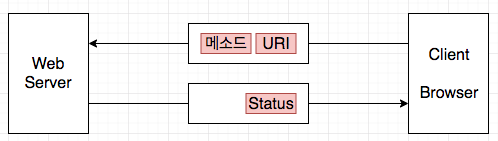

# HTTP
- **HTTP Protocol**: 클라이언트와 서버가 주고받는 메시지의 내용이나 순서를 정한 것
- **URL**: Uniform Resource Locator ex) `http://~~~~~`
- **URI**: Uniform Resource Indetifier ex) `/dir/file.html`

## HTTP 기본 개념


## HTTP Message
### HTTP Request Message
```
<메서드><공백><URI><공백><HTTP VERSION>  // 리퀘스트 라인(Request Line)
<필드명>:<필드값> /* 여기서부터 메시지 헤더
        .
        .
        .         한 행에 한 개의 헤더 필드
        .
        .
<공백 행>         공백 행까지 포함해서 메시지 헤더 */
<메시지 본문>     // 클라이언트에서 서버에 송신하는 Data(Form data 등)
```
### HTTP Response Message
```
<HTTP VERSION><공백><스테이터스 코드><공백><응답 문구> // 스테이터스 라인(Status Line)
<필드명>:<필드값> /* 여기서부터 메시지 헤더
        .
        .
        .         한 행에 한 개의 헤더 필드
        .
        .
<공백 행>         공백 행까지 포함해서 메시지 헤더 */
<메시지 본문>     // 서버에서 클라이언트로 송신하는 데이터, 바이너리 데이터로 취급
```
