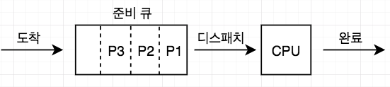
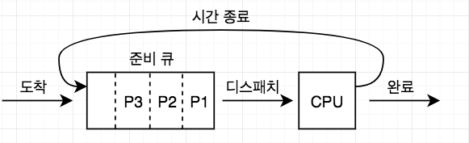
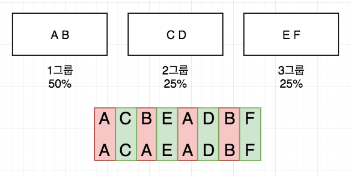
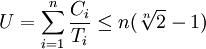

# CPU 스케줄링
- 메모리에 여러개의 프로세스를 올려놓고(다중 프로그래밍), CPU의 가동시간을 적절히 나누어(시분할) 각각의 프로세스에게 분배하여 실행되도록 한다.
- 여러 프로세스들이 번갈아가며 사용해야하는 자원이 있을경우 주어진 시점에서 어떤 프로세스가 이 자원을 사용할 수 있도록 해줄 것인가를 결정하는것.

## 스케줄링의 단계
- 요구되는 시점으로 구분함
- 장기(Long-term)
  1. 어느 작업을 커널에 등록시켜 프로세스로 만들어 줄 것인가(Job Scheduling)
  2. 일괄 처리: 작업이 들어오면 디스크에두고 일괄처리 큐에서 대기후 장기 스케줄러를 거쳐 프로세스가 되도록 함
  3. 시분할: 사용자의 접속시도를 허용할지 말지 결정
  4. 다중 프로그래밍의 정도를 조절
  5. 수행 횟수가 적고 대부분 `FIFO(First In First Out)`방식을 사용
- 중기(Medium-term)
  - 보류 상태의 프로세스들 중에서 어느 프로세스에게 메모리를 할당해 줄 것인가 (Swapping)
- 단기(Short-term)
  - 준비상태의 프로세스중에서 어느 프로세스에게 CPU를 할당할지 결정
  - 프로세스 스케줄러 or Dispatcher에 의해 수행

## 스케줄링의 목적과 기준
  - 사용자 관점: 응답시간
  - 시스템 관점: 처리량
  - 동시에 만족시키긴 힘들다
  - CPU 연산 > 입출력 : CPU-Bound 프로세스
  - CPU 연산 < 입출력 : I/O-Bound 프로세스

## 스케줄링 기법들
- 스케줄링이 가동되어야 할 때
  1. 프로세스가 실행에서 대기상태로 (입출력 요청)
  2. 프로세스가 실행에서 준비로 (시간종료같은 인터럽트)
  3. 프로세스가 대기에서 준비로 (입출력 종료)
  4. 프로세스가 수행을 마치고 종료

- 비선점(Nonpreemptive) 방식
  - 한 프로세스가 CPU를 할당 받았을 때 스스로 반환 할 때까지 계속 사용하도록 허용함
- 선점(Preemptive) 방식
  - CPU를 할당받아 실행중인 프로세스로부터 CPU를 빼앗아 다른 프로세스에게 할당 가능

### FCFS(First Come First Service)
  - 
  - 비선점 방
  - 준비큐에 들어온 순서대로 처리
  - 어떤 순서대로 처리될지 예측 가능성이 높다
  - 평균 응답시간 계산
    - | 프로세스  | 도착 시간  | CPU 요구량 |
      |----|---|-----|
      | P1 | 0 | 100 |
      | P2 | 0 | 10  |
      | P3 | 0 | 10  |
      | P4 | 0 | 10  |
    - P1 -> P2 -> P3 -> P4 순서대로 준비 큐에 들어왔다고 가정
    - 평균 응답시간 = (100+110+120+130)/4 = 115초
    - P4 -> P3 -> P2 -> P1 순서대로 준비 큐에 들어왔다고 가정
    - 평균 응답시간 = (10+20+30+130)/4 = 47.5초
### SPN(Shortest Process Next) 혹은 Shortest Job First
  - CPU 요구량이 적은 것 부터 처리
  - 비선점 방식
  - CPU 요구량이 높은것은 무한대기 할 수도 있음
  - 어떤 순서대로 처리될지 예측 힘듦
  - 무한대기 가능성을 낮추기위해 에이징(Aging)을 이용하기도 함(대기가 오래될 수록 우선순위를 높여줌)
  - 평균 응답시간 계산
    - | 프로세스  | 도착 시간  | CPU 요구량 |
      |----|-----|----|
      | P1 | 0   | 10 |
      | P2 | 0.5 | 5  |
      | P3 | 1   | 2  |
    - P1 -> P3 -> P2 순서대로 처리된다
    - P1이 가장 먼저 도착 후 CPU를 10초 동안 사용했으므로 P2, P3는 이미 도착해 있고 이때는 CPU의 요구량이 적은 P3부터 처리된다.
    - 평균 응답시간 = (10+(12-1)+(17-0.5))/3 = 12.5초

### SRT(Shortest Remaining Time)
  - SPN을 선점 방식으로 운영
  - CPU 요구량이 작은게 많이 들어오면 Context Switching 비용이 많이 든다.
  - 임계 값을 두어 선점을 못하게 해서 Context Switching이 덜되게 개선 가능하다.
  - 평균 응답시간 계산
    - | 프로세스  | 도착 시간  | CPU 요구량 |
      |----|-----|----|
      | P1 | 0   | 10 |
      | P2 | 0.5 | 5  |
      | P3 | 1   | 2  |
    - P1 -> P2 -> P3 -> P2 -> P1 순서대로 처리됨
    - CPU를 할당하지 않고 대기했다가 처리하는게 더 빠를 수도 있음
    - 1초 대기 -> P3 -> P2 -> P1 순서대로 처리되고 평균 응답 시간을 계산해보면 더 빠르다. (Context Switching도 덜 발생)

### HRRN(Highest Response Ratio Next)
  - SPN과 SRT 방식의 약점인 수행시간이 긴 프로세스의 무한대기 현상을 방지하기 위한 기법
  - 응답률이 가장 높은 프로세스에게 높은 우선순위를 부여한다.
  - 비선점 방식
  - 응답률 = (대기시간 + CPU 요구량)/CPU 요구량

### Round-Robin(라운드 로빈)
  - 
  - FCFS 스케줄링을 기반으로하여 CPU를 할당하되 각 프로세스는 한번에 쓸 수 있는 CPU 시간(시간 할당량)이 지나면 시간종료 인터럽트에 의해 CPU를 빼앗긴다.
  - 선점 방식
  - FCFS에서 프로세스 하나가 CPU를 독점하는 단점을 방지하지만 Context Switch의 오버헤드를 감수해야함

### Multi-Level Queue(다단계 큐)
  - 정적 우선순위를 사용하는 스케줄링
  - 선점 방식
  - 우선순위 개수만큼 Queue가 있다.
  - 가장 우선순위가 높은 Queue부터 작업을 처리하다가 더 높은 우선순위가 들어오면 선점 방식으로 CPU를 빼앗아 할당함
  - 우선순위가 정적이므로 프로세스가 다른 우선순위 Queue에 들어갈 수 없다

### Multi-Level Feedback Queue(다단계 피드백 큐)
  - 동적 우선순위를 사용하는 스케줄링
  - 선점 방식
  - 우선순위 개수만큼 Queue가 존재 (CPU 할당량이 낮을수록 우선순위가 높다)
  - 최상위 단계의 준비큐부터 FCFS의 순서로 실행 후 해당 큐의 할당량이 끝나면 아래 준비큐에 들어감
  - 큐의 할당량을 다 사용할때까진 우선순위가 높은 큐에 CPU를 바로 빼앗기진 않는다.
  - 우선순위가 낮을수록 시간 할당량이 많다.
  - 마지막엔 결국 Round-Robin 방식이 됨
  - 입출력에의해 할당량을 채우지 못하고 CPU를 내놓게되면 입출력 Process를 한단계 높은 큐로 옮긴다.

### Fair-Share 스케줄링
  - 
  - 모든 프로세스를 한 그룹으로 두지 않고 여러그룹으로 두어 특정 프로세스가 CPU를 많이 사용했을 때 다른 그룹까지 피해가 가지 않도록 하는 방식
  - 그림을 보면 A 프로세스가 CPU를 많이 사용했지만 2그룹과 3그룹엔 영향이 없는 것을 볼 수 있다.

## 실시간(Realtime) 스케줄링
  - 실시간 시스템
    - 실행될 모든 프로세스들이 정해진 시간 내에 완료되어야하는 시스템
  - Hard Realtime
    - Deadline 내에 작업이 완료되지 않으면 치명적인 결과를 냄 (시스템 중지 등)
  - Soft Readtime
    - Deadline이 지나고 완료된 일은 가치가 점점 떨어짐
  - 정적 방법: 프로세스들의 특징과 개수를 알 때 유용
  - 동적 방법: 생성시간이나 특성을 모를경우 사용

### RM(Rate Monotonic) 알고리즘
  - 대표적인 정적 스케줄링 방식
  - 크기와 개수가 알려진 프로세스들이 주기적으로 발생하는 환경에서 사용
  - 주기에 반비례하게 우선순위 배정
  - 
  - 위 공식을 이용하여 스케줄링이 가능한지 여부를 알 수 있음 (T는 주기, C는 CPU 요구량)
  - 스케줄링 비용이 적은대신 새로운 프로세스가 추가되면 전체 스케줄링을 다시 해야한다.

### EDF(Earliest Deadline First) 알고리즘
  - 프로세스의 마감 시한이 가까울수록 우선순위를 높게 부여
  - 선점형 동적 스케줄링
  - 
  - 위 공식을 이용하여 스케줄링이 가능한지 여부를 알 수 있음
  - 새로운 프로세스의 동적인 수용이 가능하지만 그럴때마다 가능한 스케줄을 찾아야하는 비용 발생

## Windows에서의 스케줄링
  - 스레드 단위로 CPU를 할당하는 우선순위에의한 선점 스케줄링
  - 우선순위 0~15 -> 일반 클래스 배정 : MFQ로 구현
  - 우선순위 16~31 -> 실시간 클래스 배정 : MQ로 구현
  - 우선순위 변동
    - 시간종료 인터럽트에의해 CPU를 빼앗기면 우선순위를 낮춤
    - 입출력 완료 인터럽트에의해 CPU를 빼앗기면 우선순위를 높임
