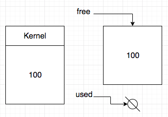
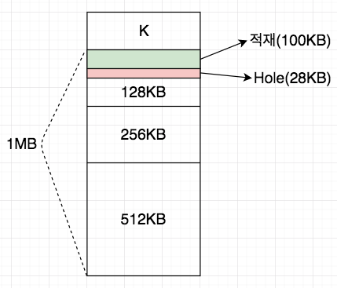
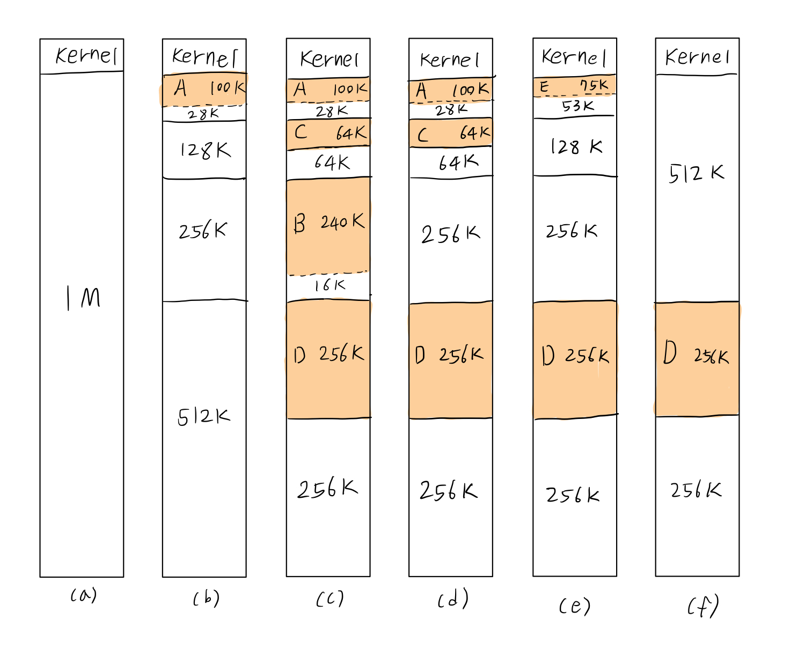

# 메모리 관리
- 메모리는 실행될 프로그램을 위한 적재 장소

## 메모리의 구성은?
- 고려사항
  1. 다중 프로그래밍 정도(Degree) -> 한번에 하나의 프로그램? 여러개의 프로그램?이 메모리에 있게 할 것인가.
  2. 메모리의 분할(고정 or 정적 분할, 가변 or 동적 분할)
  3. 메모리 할당을 연속적 or 비연속적으로 할 것인가.

## 메모리 관리는?
- 적재 기법(Fetch Strategy): 프로세스에게 언제 메모리를 할당해줄 것인가.
  1. `요구(Demand) 적재` -> 대부분 이걸 채택함
  2. 예상(Anticipatory) 적재

- 배치 기법(Placement strategy)
  - 프로세스들을 메모리 공간 어디에 적재할 것인가.

- 교체 기법(Replacement Strategy)
  - 메모리 공간이 부족할 경우 새로 적재돼야 할 프로세스를 위해 이미 메모리에 있는 프로세스 중 어떤 것을 골라 디스크로 보내고 공간을 확보 할 것인가에 요구되는 기법

- 할당 기법(Allocation Strategy)
  - 프로세스에게 메모리 공간을 얼마 정도로 줄 것인가.

## 단일 프로그래밍
- 한 번에 하나의 프로세스만이 메모리에 적재되고 실행이 종료되면 다음 프로세스가 적재되는 시스템
- 메모리의 크기가 적재할 프로그램의 크기보다 크거나 같으면 문제가 없지만 그렇지 않을경우 `Overay`방식을 써야함.
  1. Overay란 프로그램의 일부만 먼저 적재하여 실행시킨 다음 나머지 부분을 다시 적재하여 실행을 이어가는 방식이다.
  2. 프로그램 실행 중 커널 영역을 침범하지 못하도록 해야한다.
  3. 경계 레지스터(Boundary Register)에 커널과 프로그램의 경계 주소값을 넣어두고, 프로그램이 참조하는 메모리의 주소값이 경계를 넘으면 트랩으로 중지시킴
- 메모리의 빈공간 및 CPU, 다른자원의 낭비가 많다.

## 고정 분할에서의 다중 프로그래밍
- 메모리를 여러개의 분할로 나누어 놓고, 각 분할에는 하나의 프로세스만을 수용하도록 함으로써 다중 프로그래밍을 구현하는 방식이다.
- 고정 분할은 분할의 개수와 크기가 변하지 않으므로 다중 프로그래밍 정도의 최대치는 분할의 개수와 같다.
- 장점: 관리가 쉽고 편리함
- 단점: 유연하게 대처하지 못함
- 프로그램들이 컴파일될 때 주소 지정이 이루어지는 경우 메모리 할당은 `Absolute Loader`에 의해 언제나 지정된 분할에 들어간다.
- 특정 분할에 쏠림이 있을 때, 비어 있으나 활용되지 못하는 분할의 낭비를 막기위해 재배치(Relocatable) 번역과 로더를 사용하여
  비어있는 어느 분할로도 들어갈 수 있게 해주어 메모리 낭비를 줄여야 한다.
- 분할 크기의 다양성, 재배치 가능함에도 고정 분할은 아직 문제점을 가지는데
  1. 나뉘어진 분할보다 더 큰 프로그램의 수용문제 -> Overay로 해결해야한다.
  2. 메모리 보호문제를 동반한다. -> 분할의 상한, 하한을 두어 메모리를 관리해야한다.
- 메모리 공간의 단편화로 메모리 낭비가 심하다.
  - 내부(Internal) 단편화: 분할내에 프로세스를 수용하고 남는 공간이 생기는 경우
  - 외부(External) 단편화: 분할의 크기 자체가 작아서 프로세스들을 수용하지 못하는 경우

## 가변 분할에서의 다중 프로그래밍
- 분할의 시기와 개수 그리고 크기가 사전에 정해진 바 없이 프로세스를 수용할 때, 그 크기만큼 메모리 공간을 할당해 줌을 말한다.
- 관리가 복잡해지고 오버헤드는 감수해야 한다.
- 가변 분할 관리를 위해 메모리에서 사용중인 공간이나 빈 공간에 대한 정보가 필요하다.

- free를 탐색해 적재가 가능한 빈 공간을 찾을 때 어떤 노드를 찾을 것인가?

### 최초 적합(First-fit)
- free list에서 요구되는 크기보다 더 큰 공간을 가지고 제일 먼저 발견되는 노드에 할당하는 방법

### 최적 적합(Best-fit)
- free list를 끝까지 탐색 후 요구되는 크기보다 크되, 가장 적은 차이인 노드에 할당
- Hole이 생김
- Hole: 빈 공간이지만 크기가 아주 작아서 실제로 할당 될 가능성이 희박하고 결과적으로 낭비되는 공간을 Hole이라고 한다.

### 최악 적합(Worst-fit)
- 최적 적합의 반대 (차이가 가장 큰 노드에 할당)
- 남는 공간을 크게 만들어보려는 목적

### 최초, 최적, 최악 해보기
```
1. 크기가 10 MByte인 process A의 적재
2. 크기가 20 MByte인 process B의 적재
3. 크기가 15 MByte이 process C의 적재
4. Process C의 메모리 반납
5. Process A의 메모리 반납
6. 크기가 50 MByte인 process D의 적재
7. 크기가 10 MByte인 prcoess E의 적재
8. process B의 메모리 반납
```

- 초기 free: `100 Mbyte`

#### 최초 적합
1. free -> `90 MByte`, used -> `A(10 MByte)`
2. free -> `70 MByte`, used -> `A(10 MByte)` -> `B(20 MByte)`
3. free -> `55 MByte`, used -> `A(10 MByte)` -> `B(20 MByte)` -> `C(15 MByte)`
4. free -> `55 MByte` -> `15 MByte`, used -> `A(10 MByte)` -> `B(20 MByte)`
5. free -> `55 MByte` -> `15 MByte` -> `10 MByte`, used -> `B(20 MByte)`
6. free -> `5 MByte` -> `15 MByte` -> `10 MByte`, used -> `B(20 MByte)` -> `D(50 MByte)`
7. free -> `5 MByte` -> `5 MByte` -> `10 MByte`, used -> `B(20 MByte)` -> `D(50 MByte)` -> `E(10 MByte)`
8. free -> `5 MByte` -> `5 MByte` -> `10 MByte` -> `20 MByte`, used -> `D(50 MByte)` -> `E(10 MByte)`

#### 최적 적합
1. free -> `90 MByte`, used -> `A(10 MByte)`
2. free -> `70 MByte`, used -> `A(10 MByte)` -> `B(20 MByte)`
3. free -> `55 MByte`, used -> `A(10 MByte)` -> `B(20 MByte)` -> `C(15 MByte)`
4. free -> `55 MByte` -> `15 MByte`, used -> `A(10 MByte)` -> `B(20 MByte)`
5. free -> `55 MByte` -> `15 MByte` -> `10 MByte`, used -> `B(20 MByte)`
6. free -> `5 MByte` -> `15 MByte` -> `10 MByte`, used -> `B(20 MByte)` -> `D(50 MByte)`
7. free -> `5 MByte` -> `15 MByte`, used -> `B(20 MByte)` -> `D(50 MByte)` -> `E(10 MByte)`
  - 최초 적합과 다르게 15 MByte의 빈 공간 대신 마지막 10 MByte의 빈 공간을 골랐다.
8. free -> `5 MByte` -> `15 MByte` -> `20 MByte`, used -> `D(50 MByte)` -> `E(10 MByte)`

#### 최악 적합
1. free -> `90 MByte`, used -> `A(10 MByte)`
2. free -> `70 MByte`, used -> `A(10 MByte)` -> `B(20 MByte)`
3. free -> `55 MByte`, used -> `A(10 MByte)` -> `B(20 MByte)` -> `C(15 MByte)`
4. free -> `55 MByte` -> `15 MByte`, used -> `A(10 MByte)` -> `B(20 MByte)`
5. free -> `55 MByte` -> `15 MByte` -> `10 MByte`, used -> `B(20 MByte)`
6. free -> `5 MByte` -> `15 MByte` -> `10 MByte`, used -> `B(20 MByte)` -> `D(50 MByte)`
7. free -> `5 MByte` -> `5 MByte` -> `10 MByte`, used -> `B(20 MByte)` -> `D(50 MByte)` -> `E(10 MByte)`
  - 최초 적합과 똑같은 결과가 되었지만 이는 똑같은 메커니즘으로 동작 한 것이 아니고 우연의 일치로 15 MByte의 빈 공간이
    최악 적합의 대상이 되었다.
8. free -> `5 MByte` -> `5 MByte` -> `10 MByte` -> `20 MByte`, used -> `D(50 MByte)` -> `E(10 MByte)`

## 메모리 병합
- Hole이 많이 생기다보면 언젠간 작게 분할된 메모리 공간을 병합해야 할 일이 생긴다.

### 인접한(Adjacent) 빈 공간의 병합(coalescing)
- 프로세스가 반납할 때마다 실행되고, 인접한 공간이 비어있지 않다면 병합하지 않는다.

### 빈 공간 전부의 통합(compaction)
- 사용중인 공간들을 메모리의 한쪽 편으로 밀착시켜 옮기고, 흩어져 있던 빈 공간들을 전부 합쳐 하나의 큰 공간으로 만듦
- 사용중인 공간의 재배치 또한 일어나므로 재배치시 모든 프로그램의 실행이 중단된다.
- 상당한 시간이 소요된다.

## 고정과 가변의 절충인 Buddy 메모리 관리
- 프로세스 적재요구가 있을 때 메모리는 요구한 크기보다 크되 차이가 가장 작게나는 2^n 크기로 분할되어 할당된다.
- `같은 크기`로 분할된 `인접`해 있는 공간을 `Buddy`라고 한다.
- 프로세스의 메모리 반납시 Buddy가 사용중이 아니라면 병합하는 방식



### Buddy 시스템 예제
#### 시나리오
```
1. 크기가 100 KByte인 process A의 적재
2. 크기가 240 KByte인 process B의 적재
3. 크기가  64 KByte인 process C의 적재
4. 크기가 256 KByte인 process D의 적재
5. process B의 메모리 반납
6. process A의 메모리 반납
7. 크기가  75 KByte인 process E의 적재
8. process C의 메모리 반납
9. process E의 메모리 반납
10. process D의 메모리 반납
```
#### 해보기

- (a) 비어있는 1MB의 메모리
- (b) 크기가 100 KByte인 process A의 적재를 위해 2^n 크기로 나누어진 메모리
  - 128 KB로 나누어진 분할에 100 KB의 process A가 적재되어 28 KB 크기의 Hole이 발생
- (c) Process B, C, D의 적재
- (d) Process B의 메모리가 반납되었지만 버디인 분할이 비어있지 않아 병합되지 않았다.
  - 이때 B가 적재되어있던 256 KB 분할의 버디는 A와 C가 적재되어있는 256KB의 분할이다.
- (e) Process A의 메모리가 반납, 반납으로 생긴 128 KB짜리 분할에 process E가 적재되었다.
      Process C의 메모리가 반납, Buddy인 바로 아래 64KB의 빈 분할과 병합 되었다.
- (f) Process E의 메모리가 반납, Buddy인 바로 아래 128KB의 빈 분할과 병합되어 256KB짜리 분할을 만들고, 바로 아래 256KB buddy또한 비어있으므로 최종 512KB로 병합되었다.
- 그림에는 없지만 process D의 메모리가 반납 된 후엔 병합되어 다시 1MB의 메모리로 만들어 질 것이다.

#### 버디 메모리주소 구하기
- 크기가 2^k이고 메모리의 시작주소가 x인 공간이 있을 때
  버디가 되는 공간의 메모리 시작주소는 `x mod 2^k+1`의 결과값이 0일때는 `x + 2^k`, 2^k일 때는 `x - 2^k`이다.
