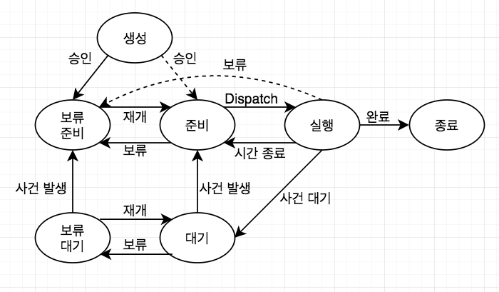

# Process와 Thread
## 프로세스(Process)
- 시스템에의해 일거리 단위로 서로 명확하게 구분되는 일
- 수행중인 프로그램

### 프로세스 제어블록(PCB)
- 프로세스가 만들어진다는건 `PCB`가 만들어진다는 것과 같다.
- 기본적으로 메모리에 저장된다.
- PCB 구성요소
  - 프로세스 번호(PID)
  - 프로세스 상태(Status)
  - 우선순위(Priority)
  - 프로그램 카운터 값(PC): 다음에 실행될 명령어의 주소가 들어있음
  - 메모리 포인터
  - Context Data
  - 할당받은 자원 목록
  - 계정 정보: CPU를 사용한 시간 등
  - 입출력 정보

### 프로세스의 상태와 변화

- 준비 상태
  - CPU를 할당 받기위해 기다리고있는 상태 (CPU만 받으면 바로 실행가능)
  - 준비상태의 여러 프로세스들은 메모리에 적재되어있음
  - 순서에따라 CPU를 할당받으면 실행상태가 되는데 이때 CPU를 할당받는 순서를 정하는 것을 `CPU 스케쥴링`이라고 한다.
- 실행 상태
  - CPU를 할당 받아 실행중인 상태
  - CPU를 할당하는 것을 `Dispatch`라고 한다.
- 대기 상태
  - 프로세스가 실행되다가 입출력 처리를 요청하거나, 바로 확보될 수 없는 자원을 요청하면 CPU를 양도하고 요청한 일이 완료되기를 기다리며 대기하는 상태
- 종료 상태
  - 프로세스가 종료될때 아주 잠시 거치는 상태
  - 프로세스는 할당되었던 모든 자원들이 회수되고 PCB만 커널에 남는다
  - 운영체제가 프로세스의 흔적과 PCB를 삭제하면 프로세스는 완전히 삭제된다
- 보류 상태
  - 프로세스가 메모리를 빼앗기고 디스크로 나감(Swapped Out)
  - 프로세스가 메모리로 복귀됨(Swapped In)
  - 프로세스가 메모리로 복귀했다가 나가고 하는 일련의 과정을 Swapping이라고 함
- 보류 준비 상태
  - 생성된 프로세스가 바로 메모리를 받지 못할 때
  - 준비, 실행 상태에서 메모리를 잃게 될 때
- 보류 대기 상태
  - 대기 상태일때 메모리 공간을 잃은 상태

## 스레드(Thread)
- 프로세스는 큰 틀이고, 세분된 작은 일 하나 하나는 `스레드`이다.
- 프로세스는 자원을 소유하고, 스레드는 스케쥴링의 단위가 된다.
- 프로세스가 가지는 자원을 스레드가 서로 공유한다.
- 다중 스레딩에서 프로세스란 보호자와 자원 할당의 단위가 된다.
- 한 프로세스 내 스레드간의 통신은 메모리와 파일을 공유하기 때문에 커널의 개입이 필요없다 (프로세스간의 통신은 커널이 필요)

### 스레드 상태의 동기화(Synchronization)
- 자원을 공유하기때문에 오류를 야기할 수 있는 상호간의 간섭이나, 데이터의 파괴등을 방지하기위한 스레드 실행의 동기화가 필요

### 스레드의 종류
1. 사용자 레벨 스레드
  - 스레드 라이브러리에 의해 관리
  - 커널은 스레드의 존재를 모른다
  - 특정 스레드의 대기가 프로세스 내의 모든 스레드의 대기를 초래
  - CPU가 프로세스 단위로 할당되어 다중처리 환경이 주어져도 스레드 단위의 다중처리가 불가능함
2. 커널레벨 스레드
  - 모든 스레드의 관리를 커널이 관리
  - 다중처리 환경에서 한 프로세스 내의 다수의 스레드는 병렬처리가 가능함
  - 같은 프로세스에 속한 스레드간 스위칭도 커널개입이 필요해 Context Switching이 잦다.
