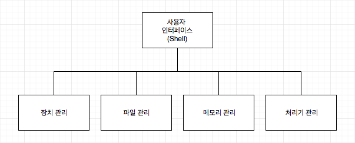
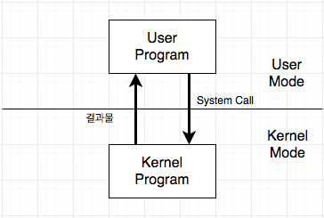
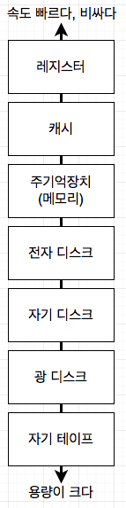

# OS
## OS란?
- 컴퓨터의 사용자와 하드웨어 사이에서 가교역할을 하는 프로그램
- 사용자 인터페이스와 자원관리를 위한 프로그램의 집합

## OS 역사
1. 1세대 - 진공관
  - IBM 701부터 운영체제 1세대로 본다 (일괄처리 시스템의 등장)
2. 2세대 - 트랜지스터
  - CPU를 할당 받을 다수개의 작업(Multi program)이 같이 주기억장치에 있다 (다중 프로그래밍 시스템)
  - 여러개의 처리장치(Multi processor)를 장착하여 동시에 여러작업을 병렬로 처리 (다중 처리 시스템)
3. 3세대 - 직접회로
  - 일괄처리, 시분할, 실시간작업 모두 지원 (Multi-mode)
  - TCP/IP 표준 발표, 근거리 통신망(LAN)이 이 시기 즈음 탄생
  - 1969년 UNIX 출현
4. 4세대 - 고밀도 직접회로
  - 컴퓨터 사용의 범용화
  - 입출력 장치의 다양화
  - 저장장치의 대용량화
  - 데이터 통신의 발전
  - 정보산업 출현
  - 마이크로 프로세서의 등장 -> 가격의 범용화
  * 마이크로 프로세서: 하나의 칩에 연산, 제어, 레지스터들을 넣은 것

## 운영체제의 5가지 구성요소
- 크게 `Kernel`과 `Utility-Program`으로 나눈다.
- 

### Kernel
- 운영체제의 핵심
- 컴퓨터가 처음 부팅될 때 주기억 장치에 적재되어 시스템종료(Shutdown)이 되기 전까지 계속 주 기억장치에 적재되어있는 프로그램
- 빈번하게 실행되는 프로그램을 디스크에 둘 경우 주 기억장치와 디스크간의 입출력이 너무 빈번하게 일어나기 때문에 성능 저하가 있다. 즉 필수적으로 자주 쓰이는 프로그램을
  메모리에 상주시키는데 이 프로그램을 Kernel이라고 한다.
- Kernel보다 더 빠른 실행이 필요하고 높은 수준의 보호가 필요한건 마이크로 프로그래밍하여 `ROM`이나 `PLA` 같은 칩으로 만들기도 하며 이를 `펌웨어(생긴건 하드웨어 내부적으론 프로그램)`라고 한다.

## System call이란?
- 
- Kernel 영역에 있는 프로그램만 할 수 있는 것들을(Disk I/O, Memory access) 유저 수준에서 사용하길 원할 때 System call을 하여 원하는 결과물을 얻을 수 있다.

## OS의 목적
- 사용자의 편리성과 자원의 효율적 사용

## 부팅
- 전원 ON -> 커널이 메모리에 올라옴(Bootstrap Loader, 부트 프로그램 등) -> 장치준비, 레지스터 초기화 -> 사용자 입력 대기

## 레지스터
1. CPU는 여러개의 레지스터를 가지고 메모리보다 빠르지만 용량이 작다.
2. 시스템과 사용목적에따라 8비트, 16비트, 32비트등의 크기를 가진다.
3. CPU는 PSW(Program Status Word)라는 현재상태를 저장하는 레지스터가 있다.

## 명령어 처리
- 명령어를 읽어 처리기에 있는 레지스터로 가져오는 것을 말함 (Fetch)

## 인터럽트(Interrupt)
- 운영체제가 자원을 효율적으로 관리하기위해 각 자원의 상황을 알아야 하는데 이를 매번 조사할 수 없으니 인터럽트라는 것을 이용한다.
- 각 자원들은 인터럽트를 통해 자신의 상태변화를 CPU에 알려줘 CPU는 폴링 방식처럼 주기적으로 시간을 들이지 않아도 각 자원의 상황을 알 수 있다.
- 즉 CPU가 처리해야 될 일들이 있을때 하드웨어 및 소프트웨어는 인터럽트를 통해 CPU에게 알릴 수 있고 처리 된다.
- 인터럽트는 크게 2가지로 `하드웨어 인터럽트`와 `소프트웨어 인터럽트(트랩)`으로 나눈다.
  - 하드웨어 인터럽트 -> 하드웨어 수준에서 일어나는 인터럽트로 CPU외부의 디스크나 마우스, 키보드의 입출력 등 CPU의 처리가 필요한 상황일 때 발생한다.
  - 트랩 -> 소프트웨어 수준에서 일어나는 인터럽트로 프로그램의 예기치 못한 종료나, CPU의 처리가 필요한 상황일 때 발생한다. (e.g. system call)

### 인터럽트의 처리
- CPU는 인터럽트가 들어오면 실행중이던 프로그램을 잠시 메모리에 돌려놓고 인터럽트 처리 루틴을 실행한다.
- 인터럽트를 처리하는 과정에서 실행중이던 프로그램의 값을 잃어버릴 수 있으므로 인터럽트 처리 전에 PSW, PC 레지스터의 값등을 시스템 스택에 저장한다.
- 인터럽트의 처리가 끝나면 PC나 PSW 정보를 CPU에 되돌리고 작업중이던 프로그램을 이어서 처리할 수 있다.
- 이러한 일련의 과정을 `Context Switching`이라고 한다.

### 중첩된 인터럽트의 처리
- 하나의 인터럽트가 끝난 뒤 다음 인터럽트를 처리하는 `순차적 처리` 혹은 Context Switching을 `중첩하여 처리`할 수 있다.
- 우선순위가 더 높은 인터럽트가 들어 왔을 때 중첩하여 처리하기도 한다.

## 기억 장치의 계층적 구조
- 
- Access Time, 용량, 가격(bit당 단가)의 차이로 분류 가능
- 속도가 높으면서 가격이 비싼게 있고, 속도가 느리고 가격이 싸며 용량이 높은 것들이 있으므로 용도에 맞게 저장장치를 계층적으로 잘 구성해야한다.

## I/O 방식
1. Programmed I/O
  - CPU가 입력을 지시 후 컨트롤러 버퍼를 계속 확인한다.
  - 인터럽트가 필요없는대신 다른 CPU 작업을 못한다.
2. Interrupt-driven I/O
  - Programmed I/O와 다르게 CPU를 다른작업에 활용 가능
  - 잦은 Interrupt가 단점이다 (잦은 Context Switching이 발생)
3. Direct Memory Access(DMA)
  - CPU대신 입출력 작업을 해줄 Channel이라는 Satellite processor를 이용하는 방식
  - CPU는 입출력할 데이터의 시작 주소와 크기등을 Channel에 알려준다.
  - 한번의 입출력(Block)단위로 CPU에게 인터럽트하므로 Interrupt-driven I/O보다 인터럽트가 적다.

## Hardware 구성에 따른 입출력
1. Isolated I/O(독립적 입출력)
  - 입출력 장치들이 입출력 버스(I/O Bus)를 통해 CPU와 연결되어 있는 경우
  - I/O Bus를 통해 해당장치의 지정, 데이터, 입출력을 구분해주는 제어 값이 전달됨
  - 입출력 명령어가 Instruction set에 추가되어 제어로직이 복잡해지고, I/O Bus를 장착하는데 추가 비용이 있다.
2. Memory-mapped I/O(메모리 주소지정 입출력)
  - 입출력 장치들이 메모리와 함께 Memory Bus에 연결됨
  - 입출력 명령어가 따로 없고 메모리 명령어를 사용한다.
  - 메모리에 추가적인 공간을 차지하는게 단점이다.
